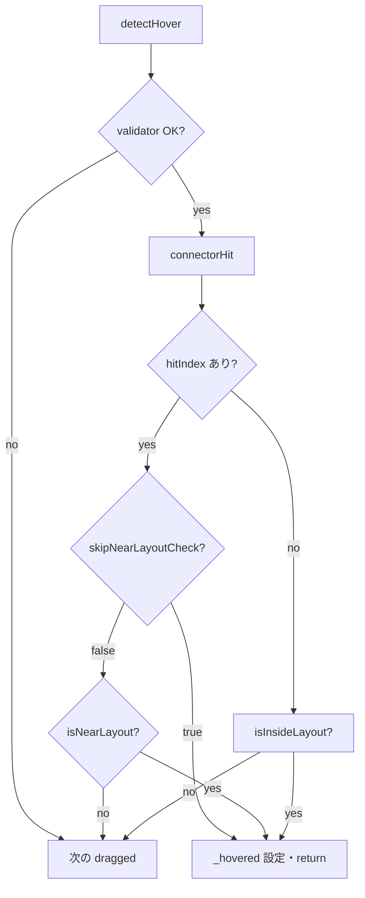

# ブロックエディタ：スロット近接ハイライトとコネクタ設定

C ブロックの body では近接ハイライト（デバッグ SVG の赤）が効くのに、**引数スロット（value ↔ slot）では効かない**、あるいは **円より外側で赤くなる**といった不具合の原因・対策と、コネクタ半径の扱いのベストプラクティスをまとめる。あわせて、**Forever の body に If をネストできない**（`topConn` と `bodyEntry` が合っているのにホバー・ネストされない）事象と、`NestingZone` の **`skipNearLayoutCheck`** による対処を記録する。

## 背景・コンテキスト

### headless-vpl 側の仕組み

- `Workspace` のイベント `proximity` / `proximity-end` で「スナップ候補に十分近い」状態が通知される。
- **SvgRenderer**（デバッグ表示 ON 時）がこれを購読し、該当コネクタのヒット円を赤くする。
- `Connector.collidesWith` は **両コネクタの `hitRadius` の和**をしきい値にした円同士の重なりで判定する。
- **SvgRenderer** のヒット円の半径 `r` は **`connector.hitRadius` に固定**（ライブラリ内コメントも「半径は実際の hitRadius に固定」）。

### クライアント（`client/web/features/editor/block-editor/`）側の役割

- **近接ループ**は `headless-vpl/blocks` の `startProximityLoop` で、毎フレーム **`collectHits()` が返す `Map<string, ProximityHit>`** を `syncProximityHighlights` に渡す形になる。
- **C ブロック body** 向けにはもともと `collectBodyZoneProximityHits` が `bodyZoneMap` から `ProximityHit` を組み立てていた。
- **引数スロット**向けには、当初 **`collectSlotZoneProximityHits` が無く**、`startProximityLoop` に渡す収集結果に **スロット分が含まれなかった**。そのため **body は赤くなるがスロットは赤くならない**という差が出た。

### 対応の流れ（概要）

1. `collectSlotZoneProximityHits` を追加し、`slotZoneMap` と `createdMap` から条件を満たすとき `slot-hit:...` 形式の `ProximityHit` を登録する。
2. `controller.ts` の `finalizeConnectionObservers` 内で、`collectBodyZoneProximityHits` と **マージ**して `startProximityLoop` に渡す。

### 別問題：円より外で赤くなる

一時的に **当たり判定より広い距離**で近接を発火させる実装（中心距離に係数を掛ける等）を入れると、**SvgRenderer は常に `hitRadius` の円**で描くため、**視覚上の円より離れた位置で赤くなる**不整合が出る。

**原因は headless-vpl の「半径と当たりが別」ではない。** ライブラリは **`hitRadius` を当たりと描画の両方に使う**。不整合は **クライアントが近接イベントの条件だけを `collidesWith` より緩めた**ことが原因だった。

## 原因と対策（表）

| 現象 | 原因 | 対策 |
|------|------|------|
| スロットでコネクタが赤くならない | 近接ループが **body 用ヒットのみ**を返していた | `collectSlotZoneProximityHits` を追加し、body と **マージ**して返す |
| 赤は出るが SVG の円より離れて赤い | 近接収集だけ **別閾値**（距離係数）を使っていた | スロット近接は **`isConnectorColliding` のみ**に揃える（独自係数を使わない） |
| Forever 等の **bodyEntry** に If の **topConn** を合わせてもネスト・近接が効かない | `NestingZone.detectHover` が `connectorHit` 成功後も **`isNearLayout`（ドラッグブロックの中心）**で棄却する。背の高い C ブロックでは中心がボディ矩形外になりやすい | body ゾーンを `createConnectorInsertZone` ではなく **`skipNearLayoutCheck: true` の `NestingZone`** で登録し、`findConnectorInsertHit` だけを信頼する（下記「事例」） |

## コネクタ半径・当たり判定のベストプラクティス

### 単一の源泉にする

- **headless-vpl** では **`Connector.hitRadius`** が  
  - 円同士の当たり（`collidesWith`）  
  - デバッグ **SvgRenderer** のヒット円の半径  
  の両方に使われる。
- **「当たり距離だけ変えて見た目はそのまま」**は、**SvgRenderer に描画を任せる限り**整合しない。  
  **反応を早く・広くしたい**場合は **`hitRadius` を上げる**（value / slot で同じ定数を使う）。

### このリポジトリでの設定場所

| 対象 | 主な定数・場所 |
|------|----------------|
| インライン値（レポーターの value / スロット） | `client/web/features/editor/block-editor/blocks/constants.ts` の **`BOOLEAN_CONNECTOR_HIT_RADIUS`**。`factory.ts` で value コネクタと slot コネクタの両方に渡している。 |
| C ブロック body 入口 | `C_BODY_ENTRY_HIT_RADIUS` など（同 `constants.ts` と `factory.ts`） |

**`BOOLEAN_CONNECTOR_HIT_RADIUS` を変更すれば、当たりとデバッグ SVG の円が同じ比率で変わる。**

### 避けるべきパターン

- **`collectSlotZoneProximityHits`（や同等の近接収集）だけ**、`collidesWith` より広い距離で `proximity` を出す。  
  → デバッグ円は `hitRadius` のままなので **「円より外で赤」** になりやすい。
- `ProximityHit.snapDistance` だけを実効閾値として広げる想定にし、**`hitRadius` と無関係な係数**で発火条件を変える。  
  → SvgRenderer は主に **位置参照でコネクタ ID を引き**、**円の半径は `hitRadius`** のため、表示とズレる。

### 再発時のチェックリスト

1. **赤くならない**  
   - `startProximityLoop` に渡す `collectHits` が、対象（スロット / body / スタック）の **`ProximityHit` を返しているか**。
2. **円と赤のタイミングが合わない**  
   - 近接収集に **`hitRadius` と無関係な係数・別距離**が入っていないか。  
   - 反応を早くしたいなら **`BOOLEAN_CONNECTOR_HIT_RADIUS`（または該当 `Connector` の `hitRadius`）を上げる**。
3. **body に C ブロックがネストできない（コネクタは合っている）**  
   - `registerCBlockBodyZones` で **`skipNearLayoutCheck: true`** が付いているか。  
   - `connections.test.ts` の Forever + If の **`detectHover` テスト**が通るか。

## 事例：C ブロック body ネストと `skipNearLayoutCheck`

### 何が起きていたか

- **操作**: Forever（C ブロック）の **body 入口**（`bodyEntry1`）に、**If**（別の C ブロック）の **上端コネクタ `topConn`** を近づけてネストしたい。
- **期待**: `findConnectorInsertHit` どおり `topConn` と `bodyEntry` が `collidesWith` すれば、`NestingZone` がホバーを取り、`InteractionManager` の pointer up でネストが成立する。
- **実際**: コネクタ同士は重なっているように見えても **`detectHover` が `null`** のままになり、近接ハイライトもネストも進まないことがあった。

### ライブラリ側の理由（headless-vpl）

`NestingZone.detectHover` は、**`connectorHit` がインデックスを返したあと**、**`skipNearLayoutCheck` が false（デフォルト）のとき** `isNearLayout(dragged)` を追加で要求する。`skipNearLayoutCheck` が true ならこのガードはスキップされる。



`isNearLayout` は **ドラッグ中コンテナの中心** `(position + width/2, position + height/2)` が、対象 `AutoLayout` の絶対座標＋マージンで囲まれた矩形内かどうかを見る（`libs/headless-vpl/src/lib/headless-vpl/util/nesting.ts` の `isNearLayout`）。

**If** のように **縦に長い C ブロック**では、ユーザーが **`topConn` を body の入口に合わせる**と、**ブロック上端は合っているが、ブロック中心はかなり下**になる。その結果、**ボディの「浅い」矩形**（空 body の `minHeight` 付近）＋マージンより **中心が下に出て** `isNearLayout` が false になり、`connectorHit` が成功していても **ホバーが棄却**される。

### クライアント側の対策（このリポジトリ）

`headless-vpl` の `createConnectorInsertZone` は **`skipNearLayoutCheck` を渡せない**ため、**body ゾーン登録だけ** `NestingZone` を直接組み立て、`createConnectorInsertZone` と同じ **`findConnectorInsertHit` + validator** にしつつ **`skipNearLayoutCheck: true`** を付与する。

**狙い**: スロットの `createConnectorSlotZone` が **`skipNearLayoutCheck: true`** を付けているのと同様に、**コネクタ一致を主信号**とし、**中心による防御チェックをオフ**にする（値ブロック拒否などは従来どおり `validator` で担保）。

`registerCBlockBodyZones` の実装例（抜粋・意味コメント付き）:

```typescript
// connections.ts — body ゾーンを登録するとき（近接収集で isConnectorColliding を使う箇所は別）
import { findConnectorInsertHit } from "headless-vpl/blocks"
import { NestingZone } from "headless-vpl"

// ... block.cBlockRef.bodyLayouts.forEach((layout, index) => {
const entry = bodyEntryConnector ?? undefined
const getDraggedConnector = (dragged: { id: string }) =>
  registry.createdMap.get(dragged.id)?.topConn
const getChildConnector = (child: { id: string }) =>
  registry.createdMap.get(child.id)?.bottomConn

const zone = new NestingZone({
  target: block.container,
  layout,
  workspace: ws,
  priority: ZONE_PRIORITY.BODY,
  padding: BODY_ZONE_PADDING,
  skipNearLayoutCheck: true,
  validator: (dragged) => {
    if (dragged === block.container) return false
    const draggedState = registry.blockMap.get(dragged.id)
    if (draggedState && isValueBlockShape(draggedState.def.shape)) return false
    return (
      findConnectorInsertHit({
        dragged,
        layout,
        entryConnector: entry,
        getDraggedConnector,
        getChildConnector,
      }) !== null
    )
  },
  connectorHit: (dragged, currentLayout) =>
    findConnectorInsertHit({
      dragged,
      layout: currentLayout,
      entryConnector: entry,
      getDraggedConnector,
      getChildConnector,
    })?.insertIndex ?? null,
})
// nestingZones.push(zone); bodyZoneMap.set(zone, { bodyEntryConnector })
```

**ライブラリ参照（挙動確認用・編集しない）**: `createConnectorInsertZone` は内部で上記と同様の `connectorHit` / `validator` を組むが、`skipNearLayoutCheck` は付けない（`libs/headless-vpl/src/lib/headless-vpl/blocks/zones.ts`）。

### テストで押さえること

`client/web/features/editor/block-editor/connections.test.ts` に、**Forever の body entry に If の `topConn` を合わせたとき `detectHover` が If を返す**ケースがある。body 登録を変更したらこのテストが落ちるか確認する。

## 関連コード（参照）

| 役割 | パス |
|------|------|
| スロット / body の近接収集・**body ゾーン（`skipNearLayoutCheck`）** | `client/web/features/editor/block-editor/connections.ts`（`registerCBlockBodyZones` 等） |
| 近接ループの結線 | `client/web/features/editor/block-editor/controller.ts`（`finalizeConnectionObservers`） |
| コネクタ生成・`hitRadius` | `client/web/features/editor/block-editor/factory.ts` |
| 半径定数 | `client/web/features/editor/block-editor/blocks/constants.ts` |
| **`NestingZone.detectHover` / `isNearLayout`** | `libs/headless-vpl/src/lib/headless-vpl/util/nesting.ts`（※サブモジュールは編集しない） |
| **`findConnectorInsertHit` / `createConnectorInsertZone`** | `libs/headless-vpl/src/lib/headless-vpl/blocks/zones.ts`（※同上） |
| SvgRenderer の赤表示 | `libs/headless-vpl/.../rendering/SvgRenderer.ts`（`setHitAreaProximity`）※サブモジュールは編集しない |
| 当たり判定 | `libs/headless-vpl/.../core/Connector.ts`（`collidesWith`） |
| body ネストの結合テスト | `client/web/features/editor/block-editor/connections.test.ts` |

## ユビキタス言語

引数スロットへ引数レポーターをはめる操作は、value コネクタと slot コネクタの近接・ネストに対応する。用語定義は [ubiquitous-language.md](../ubiquitous-language.md) を参照。
